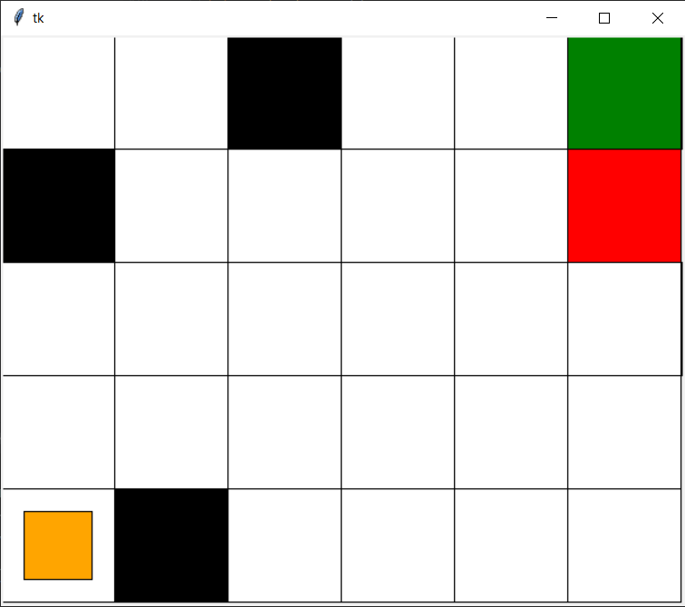
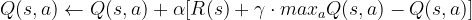
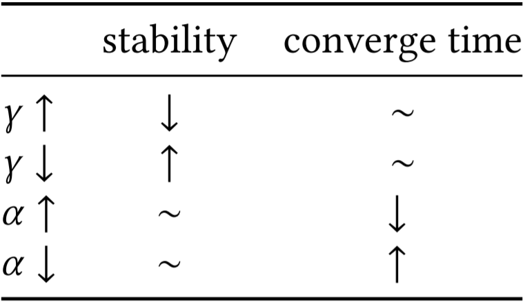

# "M×N World Game" with Q-learning  
An attempt on solving the (m, n) world game by exploration and exploitation, using an **active reinforcement learning algorithm**: **Q-learning**.

## Game description
The world setup is a **M×N** grids with 3 different kinds of stages: **Start**,  **Terminate** and **Obstacles**. **Start** denotes the starting location of the agent; **Terminate** denotes the destination of the agent; and the **Obstacles** are the blocks which won't allow to be entered. The goal is to try to get to the best rewarded Terminate state with as maximal rewards as possible.

 
    

## Q-learning
**Q-learning** is an active reinforcement learning (RL) technique. Reinforcement learning contains two important components: **exploration** and **exploitation**. **Exploration** means that the agent is interacting with the environment and try to find the best policy; **Exploitation** means that the agent is trying to improve the current recorded best policy. **Q-learning** is an active RL algorithm, which is attempt to find the (local) optimum policy if possible. It is driven by the rewards it received, and updates the rewards using the following rules:

    

For more information about **Q-learning**, the wikipedia page is a good way to start: [Q-learning wikipedia](https://en.wikipedia.org/wiki/Q-learning).

## Instructions
    ##Make sure both learner.py and world.py is under the same directory
    python learner.py

## Testing
**Parameter Testing**: Q-learning is an active reinforcement learning algorithm - it strives to learn an optimal policy of a given environment. In the 𝑚×𝑛 worldgame, we have no control over the world’s setup (obstacles, rewards etc), but we can test different parameters to note differences in performance.
The following tests are all univariate control analysis, they are performed under a fixed environment, and reward sets.
 - **Discount rate 𝛾**: Discount rate denotes the importance of the rewards received from future states. After testing, we found that the major impact discount rate has on the training is on exploration. Big discount rate helps the agent converge to a local optimum faster, but more importantly, the exploration will have larger impact on the learned optimal policy, this leads to the agent fluctuating on the main optimum path. If we have a lower discount rate, the exploration will haveless of an impact on the training process, but this also means it will be more difficult to escape from the local optimum.
 - **Learning rate 𝛼**: The learning rate denotes how much the current state should be updated. Alpha should have range of ***𝛼 ∈ [0,1]***. After testing, we have observed that alpha’s performance is actually related to the set discount rate. The discount rate we set originally was 0.5, under this setting, alpha must be relatively big in order to have a significant effect on the policy. In our experiment, if we set both alpha and gamma to be 0.5, it requires nearly 4 times longer (notvery accurate, because it is timed manually) in order for the agent to converge to a local optimal, compared to ***𝛼 = 1***. If the discount rate is higher, alpha can be set to a lower value, and we observe a lower convergence time. In general, the learning rate determines the convergence time, and it has a lower impact on the training process and the results,compared to the discount rate.

    

**Randomization Testing**: Two different types of randomization are implemented in our program. First is the random action. At each step, there is a chance the agent will make a random move instead of the recorded optimal action, in order to explore the world. The second randomization used is the random starting location. We wanted to see which randomization was more effective. It turns out that the executions using the first randomization have a very small improvement compared to ones without any randomization. The reason is that in order for it (randomization) to alter the currentpolicy, it requires consecutively making the same move at a specific state, and this event has a very low probability. The second type of randomization helps us obtain the policy for the entire world, but it does not have significant effect on policy learning.

**Correctness/Optimality Testing**: After using Q-learning to learn a policy from a given world setup, we used an MDP results-map to check if the learned policy was consistent with the passive reinforcement learning result. In our testing, we found that Q-learning will always find an optimal path, regardless of all the above factors. However, it is not guaranteed or likely to find the global optimal path (in terms of the MDP results).
